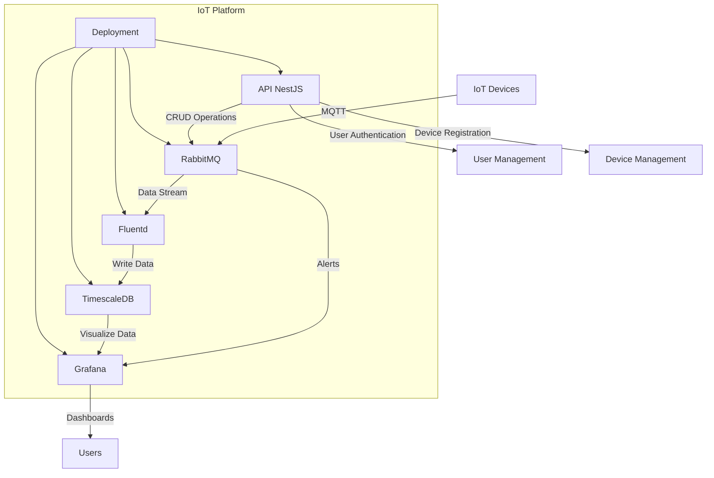

# IoT Platform



## Overview
This project is an IoT platform designed to register IoT devices, collect temperature data, track device health, and visualize the collected data. The platform supports MQTT for device communication and utilizes RabbitMQ, PostgreSQL with TimescaleDB, and Grafana for data visualization.

## Features
- Device registration endpoint
- User authentication (all users are admins)
- Data visualization dashboards using Grafana
- Alerts for device health, integrated with Grafana
- CLI tool for CRUD operations interacting with the API

## Technical Specifications
- **IoT Device Type**: Temperature sensors connecting via MQTT
- **MQTT Broker**: RabbitMQ with the MQTT plugin
- **Authentication**: Certificate-based authentication using RabbitMQ's cert auth method
- **Data Ingestion**: Fluentd connector to write data from RabbitMQ to TimescaleDB
- **Backend Framework**: Node.js with NestJS for the registration endpoint and CRUD operations
- **Device Registration**: IoT devices will register using a secret key
- **Backend Database**: PostgreSQL with TimescaleDB
- **Local Development**: Docker Compose for running services locally
- **Testing Methodology**: End-to-end (E2E) testing following Test Driven Development (TDD)

## Getting Started

### Prerequisites
- Docker
- Docker Compose
- Node.js
- PostgreSQL
- RabbitMQ
- Fluentd

### Installation
1. Clone the repository:
   ```bash
   git clone <repository-url>
   cd <repository-directory>
   ```

2. Set up the Docker environment:
   ```bash
   docker-compose up -d
   ```

3. Install the necessary Node.js dependencies:
   ```bash
   npm install
   ```

### Running the Application
- Start the application:
  ```bash
  npm run start
  ```

- Access the API at `http://localhost:<port>` (replace `<port>` with the appropriate port number).

### CLI Tool
- Use the CLI tool to interact with the API for CRUD operations.

### Testing
- Run tests using the following command:
  ```bash
  npm run test
  ```

## Deployment
- Instructions for deployment will be provided based on the target environment.

## License
This project is licensed under the MIT License - see the [LICENSE](LICENSE) file for details.

## Acknowledgments
- RabbitMQ for MQTT support
- PostgreSQL and TimescaleDB for time-series data storage
- Grafana for data visualization
- Fluentd for data ingestion